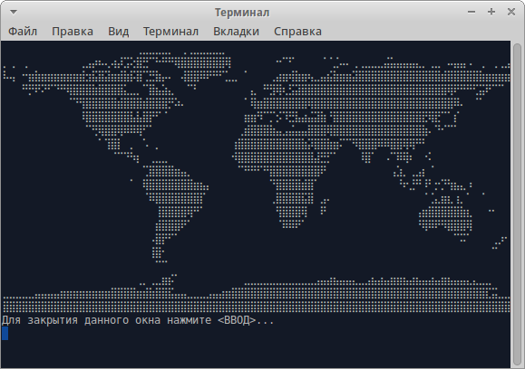
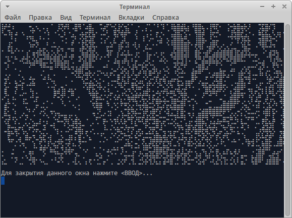

# Braxel
ASCII demonstration of Braille-based picture drawing

Uses Braille symbols by provided byte-map.
Could be used for any image or byte-map.

This repository contains functions for:
* loading/saving byte map from file
* loading data from png files
* printing data to terminal
* drawing data on another data
